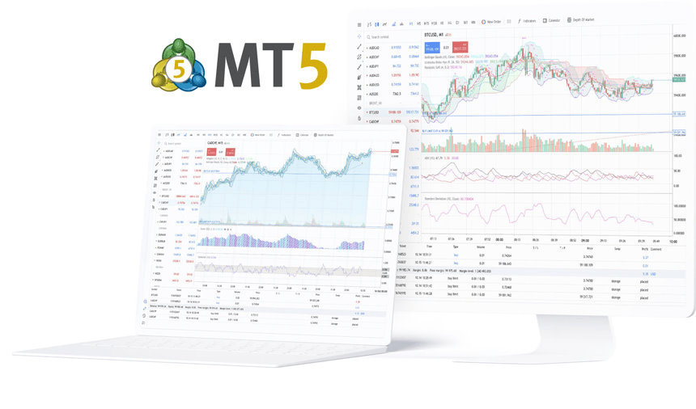

## What's New!
<p>
  <a href="https://youtu.be/dofuWK_25J8">
    
  </a>
</p>

## What is StrategyTester5?

Full documentation -> [https://strategytester5.com](https://strategytester5.com)

StrategyTester5 (ST5) is a Python framework for building, testing, and optimizing algorithmic trading strategies using the MetaTrader 5 platform.

It extends the native [MetaTrader 5 Python API](https://pypi.org/project/metatrader5/) by adding high-performance backtesting, simulation, and data handling capabilities that are not available out of the box.


<!--  -->

## Why StrategyTester5?

The official MetaTrader5 Python API provides access to market data and trading operations — but it lacks a built-in way to efficiently backtest and simulate trading strategies.

> StrategyTester5 fills this gap by providing backtesting and optimization capabilities.

!!! Note "Note"
    
    Built for developers who want full control over their trading logic without leaving the MetaTrader 5 ecosystem.

## How it Works

It simulates the MetaTrader5 API on the actual historical data from the MetaTrader5 terminal. See [a quick start guide](https://strategytester5.com/quickstart/).

# Installation

## With pip (recommended)
This package is available at Python package index [pypi.org](https://pypi.org/project/strategytester5/).

```bash
pip install strategytester5
```

Or, you can install while checking for the updates. 

```bash
pip install -U strategytester5
```

## With git

Of course, you can pull strategytester5 directly from the [GitHub repository](https://github.com/MegaJoctan/StrategyTester5).

Git clone:

```bash
git clone git@github.com:MegaJoctan/StrategyTester5.git strategytester5
```

Install the cloned repository as a package:

```bash
pip install -e strategytester5
```

# Quick Start | Build & Test your First Trading Robot

All you need is to add three (3) Lines of code to your existing Python project.

## 01: Import the VirtualMetaTrader5 class

```Python
from strategytester5.MetaTrader5.api import VirtualMetaTrader5
```

## 02: Assign the parent (MetaTrader5) initialized instance to the VirtulMetaTrader5 object
```Python
if not mt5.initialize():
    raise RuntimeError(f"Failed to initialize mt5. Error = {mt5.last_error()}")

virtual_mt5 = VirtualMetaTrader5(parent_mt5=mt5)
```

## Optional : Choosing the right MT5 instance
Since the VirtualMetaTrader5 object has similar methods and constants to MetaTrader5 API.

To keep all the code in a single file, introduce if statements to check for passed arguments from the script.

!!! Note "Rule of Thumb"
    
    For instance, if a user has passed `--backtesting` when calling the main script the script should use a simulated MetaTrader5 rather than the actual one.

    ```python
    script_argument = sys.argv[1:]
    if "--backtesting" in script_argument:
        mt5 = VirtualMetaTrader5(parent_mt5=parent_mt5) # Assign parent MetaTrader5 to the virtual MetaTrader5 class object
    else:
        mt5 = parent_mt5
    ```

    > Always use the virtual MetaTrader5 object for backtesting and visualization purposes and stick to the original one for live trading. *That's all*

## 03: Backtesting your Python Trading Strategies

To Backtest your trading systems call the function `run_backtesting`.
```python
if "--backtesting" in script_argument:

    stats = run_backtesting(
        main_function=main,
        tester_config=tester_config,
        virtual_mt5=mt5,
        logging_level=logging.DEBUG
    )

else:
    # run the script on the market (realtime)
    while True:
        main()
```

## Tester Configurations

The so-called `tester_config` is supposed to be a dictionary with a set of key, and value pairs that resemble MetaTrader5's strategy tester section.


```python title="example tester config(s)"
tester_config = {
        "bot_name": "RSI Strategy Bot",
        "symbols": ["EURUSD"],
        "timeframe": "H1",
        "start_date": "01.01.2026",
        "end_date": "01.06.2026",
        "modelling" : "open price only",
        "deposit": 1000,
        "leverage": "1:100"
}
```
[Learn More.](https://strategytester5.com/documentation/#metatrader5-like-strategytester-configurations)

!!! Note "Rule of Thumb"

    Storing tester configuration in a JSON file is the best way forward. It helps adjust the values without changing the original code :)
    
Backtest your Python bots in MetaTrader5 👉 [Learn How](https://omegajoctan.gumroad.com/l/strategytester5-professional)
